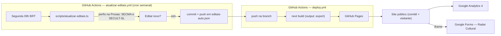

# Comitê Maranhão do Movimento Nacional de Trabalhadoras e Trabalhadores da Cultura Paulo Gustavo

Site institucional do Comitê, com editais abertos (Estado do Maranhão e São Luís) e links
oficiais para emissão de certidão negativa.

## Rodar localmente

```bash
npm install
npm run dev
```

Abra [http://localhost:3000](http://localhost:3000).

## Stack

- Next.js (App Router) + TypeScript, export estático (`output: "export"` em `next.config.ts`)
- Tailwind CSS v4 — tokens de marca em `src/app/globals.css`
- Deploy: **GitHub Pages**, via GitHub Actions (`.github/workflows/deploy.yml`)

## SDD — Documento de Design do Sistema

Visão geral de arquitetura, pra quem chega no projeto sem ter acompanhado a conversa toda.

### Objetivo

Site institucional estático que resolve três problemas concretos do Comitê: (1) centralizar
editais de fomento à cultura abertos no MA/São Luís, (2) reunir os links oficiais de emissão
de certidão negativa exigidos nesses editais, (3) cadastrar fazedores e fazedoras de cultura
(Radar Cultural) pra indicação a produtores/curadores e aviso de edital por área/município.

### Restrição que define a arquitetura

GitHub Pages só serve arquivo estático — sem servidor, sem banco de dados, sem rota de API.
Toda peça "dinâmica" do site (redirect de link, robô de atualização, formulário) teve que ser
resolvida sem depender de um backend próprio: redirect virou página estática com JS,
atualização de dados virou workflow do GitHub Actions que comita direto no repositório, e
cadastro de usuário foi delegado ao Google Forms.

### Diagrama



### Componentes

| Componente | Onde mora | Responsabilidade |
| --- | --- | --- |
| Páginas (`src/app/**/page.tsx`) | build estático | conteúdo e layout de cada rota |
| Conteúdo estruturado (`src/content/*.ts`) | build estático | editais, certidões, FAQ — dados que viram HTML no build |
| `editais-auto.json` | commitado no repo | achados do robô semanal, mesclados com `editais.ts` em runtime de build |
| `scripts/atualizar-editais.ts` | roda só no Actions | scraper — não faz parte do bundle do site |
| Analytics (`GoogleAnalytics.tsx`, `TrackedLink.tsx`) | client-side | GA4, condicional a `NEXT_PUBLIC_GA_MEASUREMENT_ID` existir |
| Radar Cultural | iframe pra fora | Google Forms hospeda o formulário e as respostas — o site não guarda dado nenhum |
| `/r/[slug]` | build estático | página por link de convite (WhatsApp), redirect via JS |

### Decisões e por quê

- **GitHub Pages em vez de Vercel:** zero conta nova, zero token manual pra criar (ver histórico
  da conversa — foi trocado depois de já estar rodando na Vercel). Custo: perde SSR/API routes,
  daí as três adaptações acima.
- **Robô de editais com `confirmarNaFonte`/`detectadoAutomaticamente` em vez de publicar direto:**
  o scraper lê link e texto do link, não o conteúdo do edital — prazo e valor errados num site
  civil tem custo real pra quem depende disso. Marca em vez de confiar sem checar.
- **Radar Cultural no Google Forms em vez de banco próprio:** cadastro de dado pessoal
  (contato, cidade, área de atuação) pedia storage com controle de acesso — GitHub Pages não
  tem onde guardar isso com segurança. Google Forms resolve sem exigir infraestrutura nova.
- **Fonte de editais é a Prosas, não o site de cada governo:** a pedido do Comitê — perfil
  único por órgão, mais fácil de ler manualmente também.

### Limitações conhecidas

- O scraper nunca rodou contra o HTML real da Prosas (ambiente de desenvolvimento usado pra
  escrever isso bloqueia acesso à internet) — primeira execução real precisa de conferência manual.
- Sem painel administrativo: conteúdo de editais/certidões é editado direto no código (Fase 2
  no roadmap).
- PNAB (Política Nacional Aldir Blanc) e Lei Paulo Gustavo são programas diferentes,
  administrados pelas mesmas secretarias — o site mostra os dois, sempre identificando qual é
  qual, pra não passar um pelo outro.

## Deploy — GitHub Pages

Habilitar uma vez, direto no navegador (também funciona pelo celular):

1. `Settings` do repositório → **Pages** → em "Build and deployment", **Source: GitHub Actions**.
2. Pronto. Todo push na branch `claude/paulo-gustavo-dom-site-1izkpv` builda e publica sozinho
   (workflow `deploy.yml`). O link fica em `https://desdobroprod-eng.github.io/Comit-paulo-Gustav/`.

Nenhum token precisa ser criado à mão pra isso — o workflow usa a permissão de deploy que o
próprio GitHub Actions já injeta.

### Domínio próprio

Se um domínio for apontado depois (tipo `comitepaulogustavo.ma`): cria um arquivo
`public/CNAME` com o domínio dentro, muda `basePath` em `next.config.ts` pra `""`, e atualiza
`site.url` em `src/lib/site.ts`.

## Variáveis de build (GitHub → Settings → Secrets and variables → Actions → aba "Variables")

- `NEXT_PUBLIC_GA_MEASUREMENT_ID` — código do GA4, formato `G-XXXXXXXXXX`. Pega em
  analytics.google.com → Admin → Fluxos de dados → toca no fluxo Web (não confundir com o
  "Property ID", que é só número). Sem essa variável o site funciona normal, só sem analytics.
- `NEXT_PUBLIC_RADAR_CULTURAL_FORM_URL` — URL do Google Forms do Radar Cultural (ver seção
  abaixo). Sem ela, a página mostra um aviso de "formulário em configuração".

Ver `.env.example` pros mesmos valores em desenvolvimento local.

## Onde editar conteúdo (Fase 1 — sem painel administrativo)

- `src/content/editais.ts` — lista de editais abertos.
- `src/content/certidoes.ts` — links oficiais de emissão de certidão negativa, por esfera.
- `src/lib/site.ts` — nome oficial, tagline e redes sociais do Comitê.
- `src/lib/redirects.ts` — destino dos links de convite dos grupos de WhatsApp (páginas `/r/*`).

A Fase 2 do projeto substitui `editais.ts` e `certidoes.ts` por um painel administrativo com
login, para que o próprio Comitê cadastre e atualize esse conteúdo sem depender de deploy —
GitHub Pages sendo estático, esse painel não pode morar no próprio site; fica pra decidir onde
hospedar quando chegar a hora.

## Manual de marca

Rascunho publicado como referência de paleta, tipografia e uso do logotipo — aplicado nos
tokens de `globals.css`.

## Analytics (GA4)

Eventos customizados já disparados: `clique_edital`, `clique_certidao`, `clique_grupo_whatsapp`,
`clique_rede_social` (ver `src/components/TrackedLink.tsx` e `src/lib/analytics.ts`).

## Robô semanal de editais

GitHub Pages não tem servidor, então o robô não é mais uma rota do site — é um workflow do
GitHub Actions (`.github/workflows/atualizar-editais.yml`) que roda toda segunda-feira,
executa `scripts/atualizar-editais.ts` (busca os perfis da SECMA e da SECULT-SL na Prosas —
`fontesOficiais` em `src/content/editais.ts`, a pedido do Comitê) e, se achar edital novo,
comita direto em `src/content/editais-auto.json` usando o token que o próprio Actions já
fornece (`permissions: contents: write` no workflow) — **nenhum token precisa ser criado à
mão**. Itens detectados assim aparecem no site com o aviso "detectado automaticamente —
confirme prazo e valor", porque o robô lê o link e o texto do link, não o conteúdo do edital.

**Importante:** o scraper reconhece o padrão de URL de edital da própria Prosas
(`/editais/{id}-slug`) mais um heurístico genérico de texto ("edital", "chamamento público"
etc.) como reforço. O ambiente usado para escrever isso não tem acesso à internet aberto —
`npm run atualizar-editais` rodou aqui e falhou por bloqueio de rede local, não por erro no
código (confirmado por `tsc` e pela mensagem de erro, que veio do proxy do ambiente, não da
Prosas). Ele deve funcionar normalmente no GitHub Actions (que tem internet igual qualquer
outro serviço), mas o primeiro disparo precisa ser conferido — vai em **Actions → Robô semanal
de editais → Run workflow** pra rodar na mão uma vez e olhar o log antes de confiar nele
rodando sozinho.

## Radar Cultural MA

`/radar-cultural` é o cadastro de fazedores e fazedoras de cultura, feito no Google Forms (não
Jotform, a pedido do Comitê). A URL atual está fixa em `FORMULARIO_PADRAO`, em
`src/app/radar-cultural/page.tsx`. Pra trocar sem editar código, defina a Variable
`NEXT_PUBLIC_RADAR_CULTURAL_FORM_URL` (ver acima) — ela sobrescreve o padrão.

O conteúdo do formulário (perguntas, ordem, obrigatoriedade) precisa ser editado direto no
Google Forms — nenhuma ferramenta conectada aqui tem acesso à API do Google Forms, só
Drive/Gmail/Calendar. A lista de campos sugerida está no histórico da conversa com o Comitê.

## Créditos de autoria

`site.idealizadores` em `src/lib/site.ts` já tem o nome de Ben-hur Real Figueiro e da 10Dobro
Prod no rodapé e nos metadados de SEO. Falta preencher `idealizadores.url` com o link oficial
(site ou Instagram da 10Dobro Prod) antes de publicar — deixei em branco para não linkar um
endereço não confirmado.
